# Sales Deal Recovery Engine

**Most sales pipelines don't lose deals. They forget them.**

A proposal gets sent. The customer goes quiet. The opportunity stays open in the CRM, and everyone assumes someone is on it.

Nobody is.

This engine is the someone.

---

## Seven open deals, one morning

This is the real test run against a GoHighLevel pipeline. To the CRM, all seven deals look the same: **Open**.

| Deal | Value | What the data showed | State | Who decided | What happened |
| --- | --- | --- | --- | --- | --- |
| Parkside Veterinary | $5,800 | New, call booked | ACTIVE | Rules | Left alone |
| Cedar & Co Interiors | $7,200 | New lead, just came in | ACTIVE | Rules | Left alone |
| Brightline Solar | $9,500 | Call booked | ACTIVE | Rules | Left alone |
| Summit Roofing | $4,500 | Contacted, then 29 days of silence | FOLLOW_UP_DUE | Rules | Follow-up email sent, contact tagged |
| Blue Oak Legal | $6,000 | No activity for 29 days | STALE_DEAL | Rules | Slack escalation, re-engage task in GHL |
| Northwind Dental | $8,500 | Proposal sent, 24 days, no reply | PROPOSAL_STALE | Claude | Follow-up written and sent |
| Harbor Fitness | $12,000 | Proposal sent, 24 days, no reply | PROPOSAL_STALE | Claude, then a person | **Nothing sent.** Owner asked to decide |

Seven deals classified and logged in one pass. Zero manual triage. Three deals got no action at all, which is exactly right.

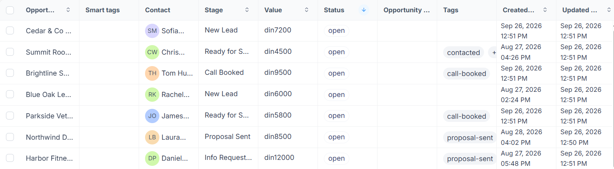

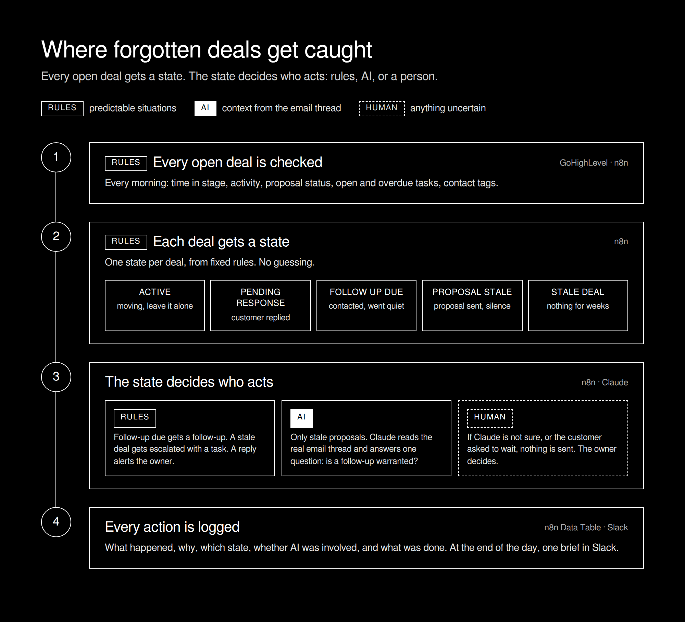

---

## The two proposals that looked identical

Look at Northwind Dental and Harbor Fitness in the table above.

Same state. Same number of days. Same risk. A rules engine cannot tell them apart, and a "follow up with every lead" automation would have emailed both.

So for stale proposals, and only there, the engine pulls the actual email thread and hands it to Claude with one question: **is a follow-up actually warranted?**

For Northwind, the answer was yes. A clear proposal, no reply, nothing in the thread saying otherwise. Claude wrote a short follow-up, and the system sent it:

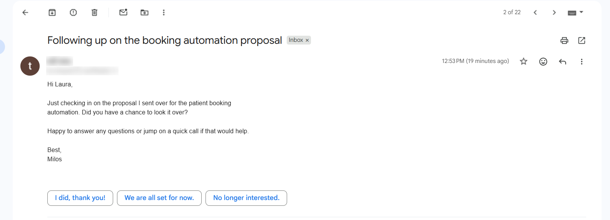

For Harbor, the answer was no:

> *"WAIT: The thread shows Milos explicitly acknowledged that Harbor Fitness only approves new vendors at their board budget meeting in November, and committed not to follow up until after that meeting. No reply is needed now since a specific later timeframe was named by the customer."*

Chasing Daniel now would have broken a promise and cost trust on a $12,000 deal. Instead, the owner got this:

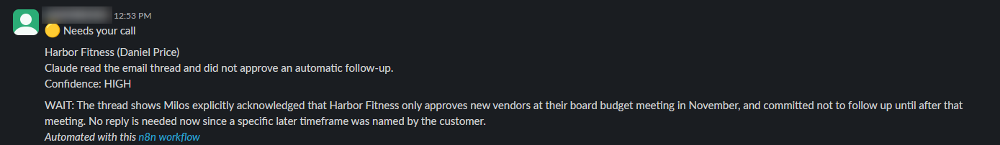

That difference is the whole reason AI is in this system at all.

---

## Rules, then AI, then a human

The AI isn't the interesting part. The decision architecture around it is.

* **Rules for predictable situations.** A deal that went quiet after first contact gets a follow-up. A deal with no activity for weeks gets escalated. No model needed.
* **AI for context.** Only stale proposals reach Claude, because only there does the email conversation change the answer.
* **Humans for uncertainty.** Claude can recommend, but it doesn't control the workflow. An email goes out only if Claude says `FOLLOW_UP_RECOMMENDED` with `HIGH` confidence *and* writes the email. Anything else (wait, unsure, do not contact) goes to the sales owner, and nothing is sent.

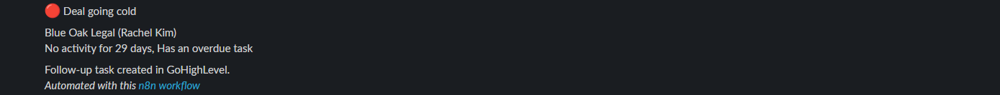

---

## Seven workflows, one job each

| # | Workflow | Job |
| --- | --- | --- |
| 01 | Daily Deal Scanner | Pulls every open deal and its tasks from GoHighLevel, normalizes it into one shape |
| 02 | Deal State Engine | Rules only. Returns state, risk and the next action |
| 03 | Follow-up Decision Engine | Routes each deal by state |
| 04 | Email Context Analyzer | Stale proposals only. Gmail thread, Claude, safety gate |
| 05 | Customer Response Monitor | Watches the inbox. A customer reply becomes PENDING_RESPONSE right away |
| 06 | Action Executor | The only workflow allowed to touch the outside world: Slack, Gmail, GHL, the log |
| 07 | Daily Brief | End of day summary in Slack |

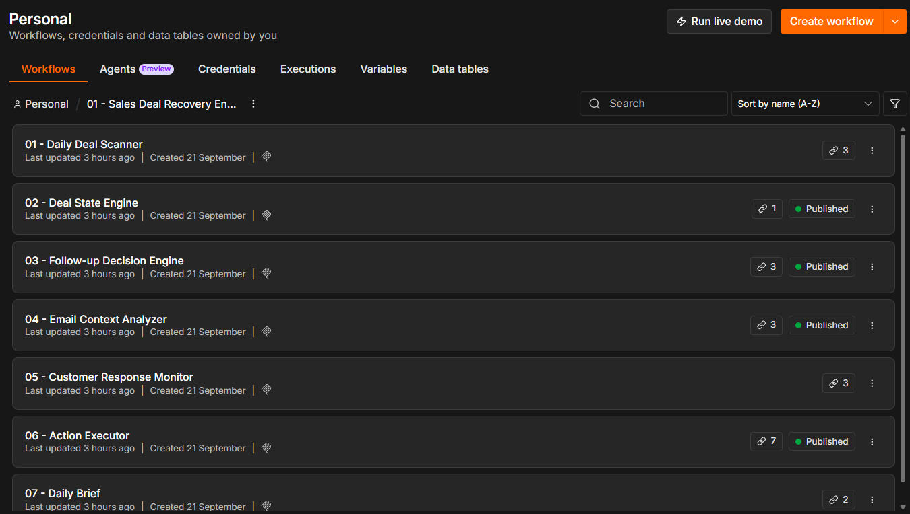

Splitting it this way is deliberate. Because every side effect goes through 06, nothing can send an email or change a contact without leaving a record.

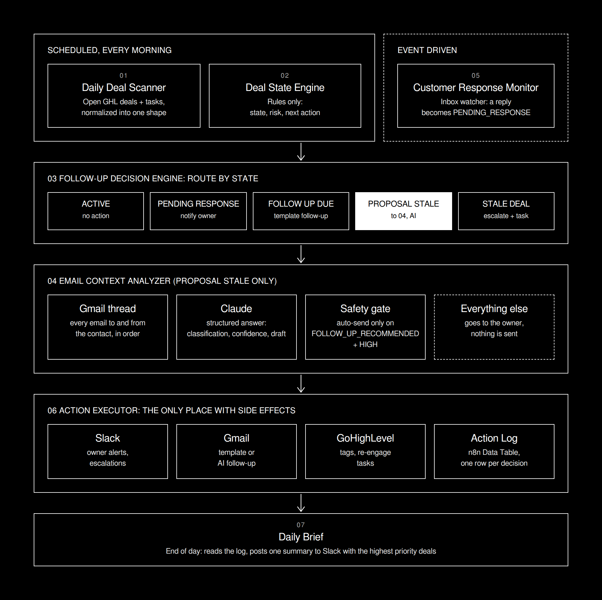

---

## The paper trail

Every decision becomes one row in a shared n8n Data Table: which deal, which state, why, what was done, whether AI was involved and how confident it was.

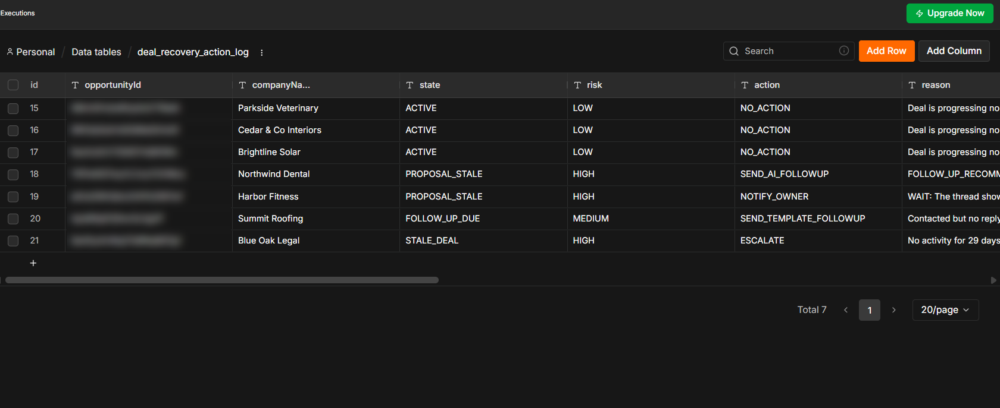

At the end of the day, 07 reads that table and posts one brief:

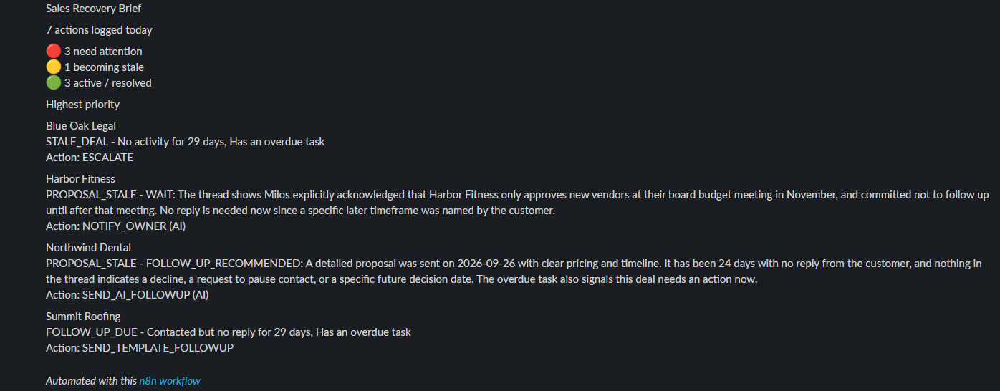

Sample data from the run: [`sample_decision.json`](sample_decision.json), [`sample_ai_decision_send.json`](sample_ai_decision_send.json), [`sample_ai_decision_wait.json`](sample_ai_decision_wait.json), [`sample_log_row.json`](sample_log_row.json)

---

## Under the hood

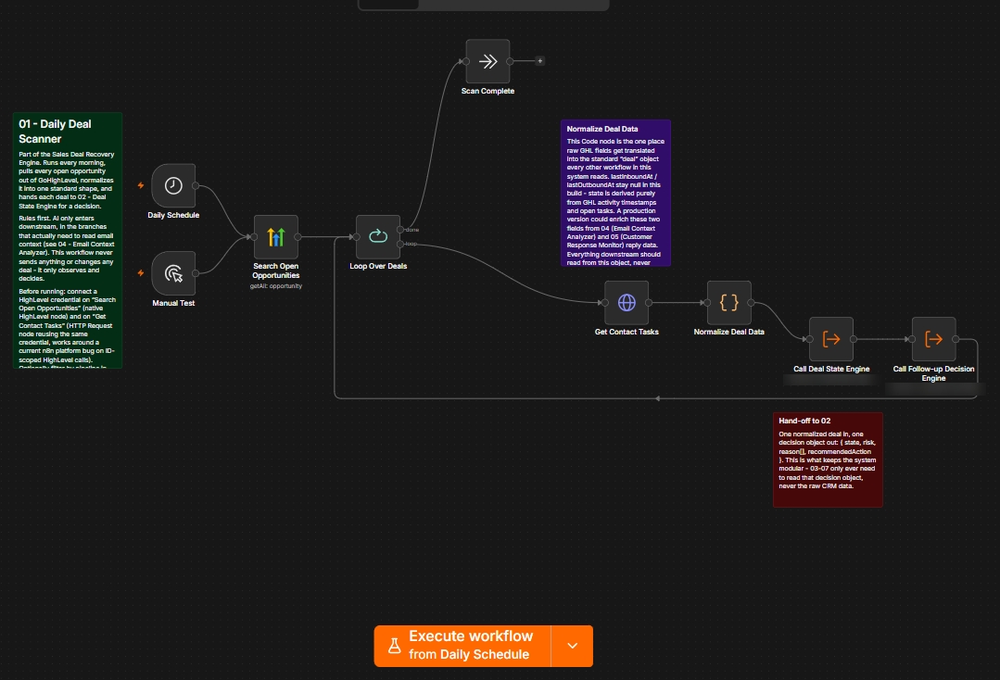

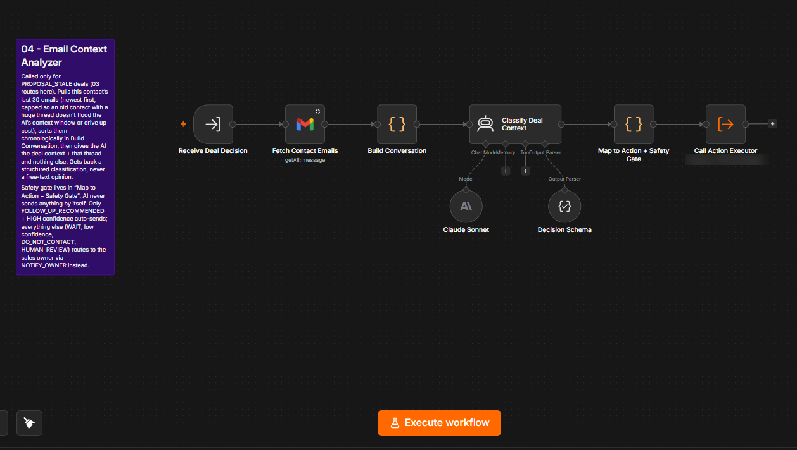

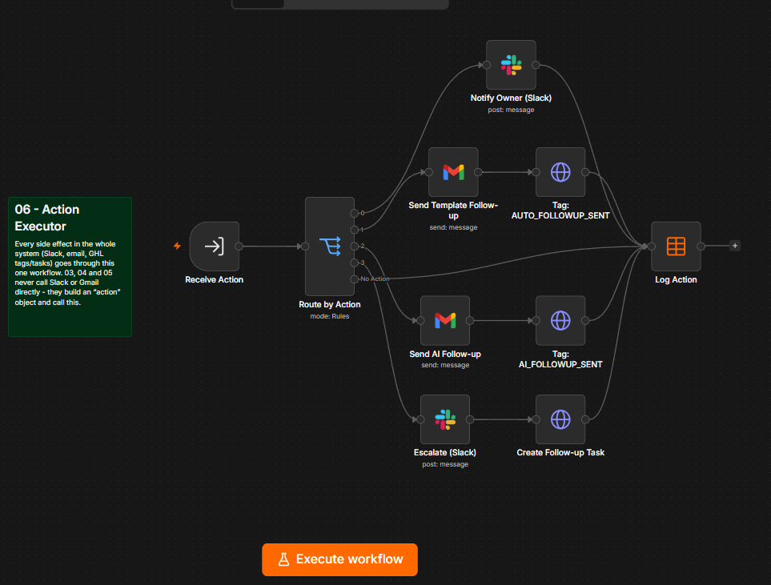

---

## Honest notes

* The test ran on a demo GoHighLevel location with seven prepared deals. All emails went to test inboxes.
* The demo location's currency is set to RSD, so GoHighLevel shows values as "din". The engine only reads the number; the table above uses $ for readability.
* The proposal emails were sent on the day of the test, while the deals had already been sitting in their stage for 24 days. That is why Claude's reasoning for Northwind mentions both.
* Customer replies are caught by 05, which watches the inbox in real time. It was not part of this morning run, so no deal shows PENDING_RESPONSE above.
* States come from what the CRM knows: stage timing, tags, tasks. If the team never tags a proposal as sent, the engine can't know it was.
* Claude only sees the email thread. Calls and texts that never made it into email are invisible to it, which is one more reason unclear cases go to a person.

---

Built with n8n · GoHighLevel · Gmail · Claude · Slack · n8n Data Tables
